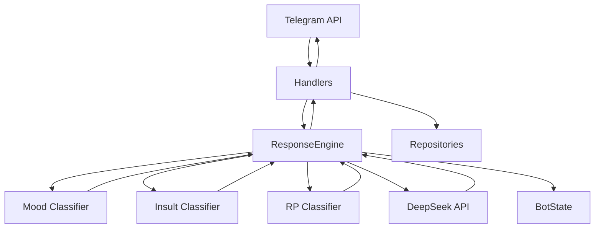

<div align="center">

# 🤖 Protogen Delta

### Асинхронный Telegram-бот с DeepSeek, RP-логикой и системой артов

<p>
  
  
  
  
  
  
</p>

**Python · aiogram · DeepSeek · Poetry · Docker · pytest**

[О проекте](#-о-проекте) •
[Возможности](#-возможности) •
[Архитектура](#-архитектура) •
[Установка](#-установка) •
[Docker](#-docker) •
[Тестирование](#-тестирование)

</div>

---

## 📖 О проекте

**Protogen Delta** — переработанная версия моего старого Telegram-бота с модульной архитектурой, интеграцией DeepSeek API, системой артов, RP-логикой и административными инструментами.

Старая монолитная структура проекта была разделена на независимые слои: Telegram-обработчики, сервисы, репозитории, конфигурацию и бизнес-логику.

> [!NOTE]
> **Главная цель рефакторинга — сделать проект не только рабочим, но и поддерживаемым.**
>
> Проект получил нормальную архитектуру, типизацию, автоматические тесты, Poetry, Docker-контейнеризацию и разделение runtime-данных от исходного кода.

### Текущее состояние

| Метрика | Значение |
|---|---:|
| Python | **3.14** |
| Tests | **127 passed** |
| Coverage | **98%** |
| Telegram framework | **aiogram 3** |
| AI | **DeepSeek API** |
| Package manager | **Poetry 2.4.1** |
| Containerization | **Docker** |

---

## ⚙️ Возможности

### 💬 Диалоги и DeepSeek

Бот использует DeepSeek для генерации ответов и дополнительного анализа входящих сообщений.

Поддерживается:

- генерация обычных ответов;
- отдельный системный prompt;
- классификация настроения;
- классификация оскорблений;
- специальные ответы на разные типы сообщений;
- изменение текущего состояния бота;
- динамическое формирование контекста;
- автоматическое добавление эмоутов;
- разбиение длинных Telegram-сообщений;
- централизованная обработка ошибок.

---

### 🎭 RP-режим

Бот поддерживает RP-действия в формате:

```text
*действие персонажа*
```

Для RP используется отдельный prompt и дополнительная классификация контекста.

Упрощённо обработка выглядит так:

```text
сообщение пользователя
        │
        ▼
определение контекста
        │
        ├── настроение
        ├── оскорбление
        ├── RP
        └── дополнительные триггеры
        │
        ▼
формирование prompt
        │
        ▼
DeepSeek
        │
        ▼
готовый ответ
```

---

### 🖼️ Система артов

Бот умеет сохранять изображения из выбранной Telegram-группы и выдавать случайный арт по команде:

```text
/randomart
```

Поддерживается:

- сохранение фотографий;
- сохранение изображений, отправленных как документ;
- добавление только из разрешённой Telegram-группы;
- защита от повторного добавления;
- случайная выдача изображения;
- просмотр количества сохранённых артов;
- просмотр последних артов администратором;
- удаление артов по Telegram `file_id`.

> [!IMPORTANT]
> **Сами изображения локально не скачиваются.**
>
> Бот хранит Telegram `file_id`, который позволяет повторно отправлять уже загруженный в Telegram файл без хранения оригинального изображения на сервере.

---

### 👤 Пользователи

При первом использовании `/start` пользователь регистрируется в локальном runtime-хранилище.

Данные приложения располагаются в:

```text
data/
```

---

## 📋 Telegram-команды

### Пользовательские

```text
/start      Запустить бота и зарегистрироваться
/help       Показать справку
/randomart  Получить случайный арт
```

### Административные

```text
/listimages <N>          Показать последние N артов
/removeimage <id1,id2>   Удалить арты по Telegram file_id
/artcount                Показать количество артов
/status                  Показать состояние текущего процесса
/ping                    Проверить административный роутер
/ownhelp                 Показать список админских команд
```

Доступ определяется через переменную:

```env
ADMIN_IDS=
```

---

## 🧩 Архитектура

Проект использует `src-layout` и разделён на слои с разной ответственностью.



### Ответственность слоёв

| Слой | Назначение |
|---|---|
| `handlers` | взаимодействие с Telegram |
| `services` | бизнес-логика и работа с DeepSeek |
| `repositories` | чтение и сохранение runtime-данных |
| `config` | настройки, prompts и статические JSON |
| `core` | инфраструктура приложения |
| `main.py` | создание и связывание зависимостей |

> [!NOTE]
> `main.py` является **composition root** приложения.
>
> Именно там создаются репозитории, сервисы, классификаторы, `ResponseEngine`, Telegram-роутеры и остальные зависимости.

---

## 📁 Структура проекта

```text
Protogen-Delta/
│
├── src/
│   └── protogen_delta/
│       │
│       ├── config/
│       │   ├── data/
│       │   ├── prompts/
│       │   ├── json_loader.py
│       │   ├── prompt_loader.py
│       │   └── settings.py
│       │
│       ├── core/
│       │   ├── logging_config.py
│       │   ├── message_utils.py
│       │   ├── state.py
│       │   └── telegram_commands.py
│       │
│       ├── handlers/
│       │   ├── admin.py
│       │   ├── art.py
│       │   ├── errors.py
│       │   ├── help.py
│       │   ├── start.py
│       │   ├── text.py
│       │   └── unknown_command.py
│       │
│       ├── repositories/
│       │   ├── images.py
│       │   ├── json_file.py
│       │   └── users.py
│       │
│       ├── services/
│       │   ├── deepseek.py
│       │   ├── emotes.py
│       │   ├── fetishes.py
│       │   ├── greetings.py
│       │   ├── insults.py
│       │   ├── mood.py
│       │   └── response_engine.py
│       │
│       └── main.py
│
├── tests/
├── data/
│
├── .env.example
├── .gitignore
├── .dockerignore
├── Dockerfile
├── pyproject.toml
├── poetry.lock
└── README.md
```

---

## 🛠️ Технологии

| Технология | Назначение |
|---|---|
| Python 3.14 | основной язык проекта |
| aiogram 3 | Telegram Bot API |
| DeepSeek API | генерация и классификация текста |
| OpenAI Python SDK | асинхронный API-клиент |
| Poetry | управление зависимостями и окружением |
| python-dotenv | загрузка переменных окружения |
| pytest | автоматические тесты |
| pytest-cov | измерение покрытия |
| Black | форматирование Python-кода |
| isort | сортировка импортов |
| Flake8 | linting |
| mypy | статическая проверка типов |
| Docker | контейнеризация приложения |

---

# 📦 Установка

## Требования

Для локального запуска необходимы:

```text
Python >=3.14,<3.15
Poetry
Git
```

Проверить версию Python:

```bash
python --version
```

Проверить Poetry:

```bash
poetry --version
```

---

## Клонирование репозитория

Через SSH:

```bash
git clone git@github.com:Exichek/Protogen-Delta.git
cd Protogen-Delta
```

---

## Установка зависимостей

```bash
poetry install
```

Poetry установит зависимости из:

```text
pyproject.toml
poetry.lock
```

Посмотреть информацию о виртуальном окружении:

```bash
poetry env info
```

> [!TIP]
> **Активировать виртуальное окружение вручную необязательно.**
>
> Команды проекта можно запускать через:
>
> ```bash
> poetry run <command>
> ```

Например:

```bash
poetry run python --version
```

---

# ⚙️ Настройка окружения

В репозитории находится шаблон:

```text
.env.example
```

Создай из него настоящий `.env`.

### Windows PowerShell

```powershell
Copy-Item .env.example .env
```

### Linux / macOS

```bash
cp .env.example .env
```

Содержимое:

```env
TELEGRAM_TOKEN=
DEEPSEEK_API_KEY=

DEEPSEEK_BASE_URL=https://api.deepseek.com
DEEPSEEK_MODEL=deepseek-v4-flash

LOG_LEVEL=INFO
DATA_DIR=data

ADMIN_IDS=

ART_CHAT_ID=
```

### Переменные

| Переменная | Назначение |
|---|---|
| `TELEGRAM_TOKEN` | токен Telegram-бота |
| `DEEPSEEK_API_KEY` | API-ключ DeepSeek |
| `DEEPSEEK_BASE_URL` | адрес API |
| `DEEPSEEK_MODEL` | используемая модель |
| `LOG_LEVEL` | уровень логирования |
| `DATA_DIR` | директория runtime-данных |
| `ADMIN_IDS` | Telegram ID администраторов |
| `ART_CHAT_ID` | ID группы для загрузки артов |

Несколько администраторов можно указать через запятую:

```env
ADMIN_IDS=123456789,987654321
```

> [!CAUTION]
> **Никогда не коммить настоящий `.env`.**
>
> `TELEGRAM_TOKEN` и `DEEPSEEK_API_KEY` являются секретами.
>
> Если такой ключ попал в публичную историю Git, его необходимо считать скомпрометированным и перевыпустить.

---

# ▶️ Локальный запуск

Запустить приложение:

```bash
poetry run python -m protogen_delta.main
```

При успешном старте появятся логи примерно такого вида:

```text
Бот запущен
Start polling
Run polling for bot ...
```

Остановка:

```text
Ctrl+C
```

> [!NOTE]
> Protogen Delta использует Telegram **long polling**.
>
> Для обычного запуска бота не требуется открывать HTTP-порт.

---

# 🐳 Docker

Проект поддерживает запуск внутри Linux Docker-контейнера.

Главная схема:

```text
Dockerfile
    │
    │ docker build
    ▼
Docker Image
    │
    │ docker run
    ▼
Container
```

Docker image содержит:

```text
Linux
└── Python 3.14
    ├── Poetry
    ├── Python-зависимости
    └── Protogen Delta
```

> [!NOTE]
> `.env` и runtime-каталог `data/` в Docker image не копируются.
>
> Секреты передаются только при запуске контейнера, а persistent data подключается отдельно.

---

## Сборка Docker image

Из корня проекта:

```bash
docker build -t protogen-delta .
```

Проверить созданный image:

```bash
docker images
```

---

## Запуск контейнера на Windows

PowerShell:

```powershell
docker run --rm `
  --name protogen-delta `
  --env-file .env `
  -v "${PWD}\data:/app/data" `
  protogen-delta
```

---

## Запуск контейнера на Linux / macOS

```bash
docker run --rm \
  --name protogen-delta \
  --env-file .env \
  -v "$(pwd)/data:/app/data" \
  protogen-delta
```

---

## Параметры запуска

```text
--name protogen-delta
```

задаёт понятное имя контейнера.

```text
--env-file .env
```

передаёт настройки и секреты в контейнер во время запуска.

```text
-v <host>/data:/app/data
```

связывает локальную директорию `data` с `/app/data` внутри контейнера.

```text
--rm
```

автоматически удаляет контейнер после завершения процесса.

> [!IMPORTANT]
> **`--rm` удаляет только контейнер.**
>
> Docker image `protogen-delta` и файлы из локальной директории `data/` остаются на месте.

---

## 💾 Persistent data

Контейнер следует считать временным.

Без bind mount:

```text
Container
└── /app/data
    ├── users.json
    └── images.json
```

эти данные принадлежат контейнеру.

При использовании bind mount:

```text
HOST
data/
   ▲
   │
   │ bind mount
   │
   ▼
CONTAINER
/app/data/
```

runtime-состояние остаётся на основной системе.

> [!IMPORTANT]
> **Runtime-данные должны жить вне контейнера.**
>
> Благодаря bind mount контейнер можно удалить, пересобрать или заменить новой версией без потери базы пользователей и артов.

---

## Запуск Docker в фоне

Добавь параметр:

```text
-d
```

Пример для PowerShell:

```powershell
docker run -d --rm `
  --name protogen-delta `
  --env-file .env `
  -v "${PWD}\data:/app/data" `
  protogen-delta
```

Посмотреть работающие контейнеры:

```bash
docker ps
```

Посмотреть логи:

```bash
docker logs -f protogen-delta
```

Остановить:

```bash
docker stop protogen-delta
```

> [!WARNING]
> **Не запускай одновременно два экземпляра бота с одним Telegram Bot Token.**
>
> Например, локальный Poetry-процесс и Docker-контейнер одновременно.
>
> Два процесса long polling будут конфликтовать между собой.

---

# 🧪 Тестирование

Проект покрыт автоматическими unit- и composition-тестами.

### Результат последнего полного прогона

| Метрика | Результат |
|---|---:|
| Tests | **127 passed** |
| Statements | **734** |
| Missed | **18** |
| Coverage | **98%** |

Тестируются:

- настройки приложения;
- JSON-загрузчики;
- prompt-загрузчики;
- repositories;
- пользователи;
- система артов;
- Telegram handlers;
- административные команды;
- error handler;
- DeepSeek service;
- классификаторы;
- mood-логика;
- insult-логика;
- RP-логика;
- `ResponseEngine`;
- форматирование сообщений;
- точка входа `main()`;
- создание зависимостей;
- подключение роутеров;
- корректное закрытие API-клиентов.

> [!NOTE]
> **Unit-тесты не отправляют настоящие запросы в Telegram и DeepSeek.**
>
> Внешние сервисы подменяются mock-объектами.
>
> Реальная работа Telegram API, DeepSeek API и Docker отдельно проверялась smoke-тестами.

> [!IMPORTANT]
> `main.py` также покрыт тестами.
>
> Точка входа проверяется без реального запуска Telegram polling: внешние зависимости заменяются mock-объектами.

---

## Запуск тестов

```bash
poetry run pytest
```

Подробный режим:

```bash
poetry run pytest -v
```

---

# 📊 Покрытие тестами

Показать общий coverage и непокрытые строки:

```bash
poetry run pytest --cov=src/protogen_delta --cov-report=term-missing
```

Текущий результат:

```text
TOTAL    734    18    98%
```

---

## HTML-отчёт

Создать интерактивный HTML coverage:

```bash
poetry run pytest --cov=src/protogen_delta --cov-report=html
```

Результат:

```text
htmlcov/index.html
```

Открыть на Windows:

```powershell
Start-Process .\htmlcov\index.html
```

HTML-отчёт позволяет открыть конкретный Python-файл и увидеть:

```text
зелёные строки   — выполнены тестами
красные строки   — не выполнялись
```

---

## XML-отчёт

```bash
poetry run pytest --cov=src/protogen_delta --cov-report=xml
```

Создаётся:

```text
coverage.xml
```

XML-report можно использовать в CI/CD и внешних сервисах анализа покрытия.

---

## Все coverage-отчёты одним запуском

### Windows PowerShell

```powershell
poetry run pytest `
  --cov=src/protogen_delta `
  --cov-report=term-missing `
  --cov-report=html `
  --cov-report=xml
```

### Linux / macOS

```bash
poetry run pytest \
  --cov=src/protogen_delta \
  --cov-report=term-missing \
  --cov-report=html \
  --cov-report=xml
```

---

# ✅ Проверка качества кода

Проект использует несколько независимых инструментов проверки.

### Black

```bash
poetry run black src tests
```

### isort

```bash
poetry run isort src tests
```

### Flake8

```bash
poetry run flake8 src tests
```

### mypy

```bash
poetry run mypy src tests
```

### pytest

```bash
poetry run pytest
```

Полный ручной quality check:

```bash
poetry run black src tests
poetry run isort src tests
poetry run flake8 src tests
poetry run mypy src tests
poetry run pytest
```

Текущий проект успешно проходит:

```text
Black
isort
Flake8
mypy
pytest
```

---

# 💾 Runtime-хранилище

Runtime-данные хранятся отдельно от исходного кода:

```text
data/
├── users.json
└── images.json
```

### `users.json`

Хранит зарегистрированных пользователей.

### `images.json`

Хранит Telegram `file_id` сохранённых изображений.

> [!IMPORTANT]
> `data/` является состоянием работающего приложения, а не частью исходного кода.
>
> Поэтому каталог исключён из Git и Docker build context.

---

# 📦 Сборка Python-пакета

Проверить корректность сборки проекта:

```bash
poetry build
```

Результат будет создан в:

```text
dist/
```

---

# 🔐 Безопасность

Не должны попадать в публичный репозиторий:

```text
.env
data/
.coverage
coverage.xml
htmlcov/
```

Особенно нельзя публиковать:

```text
TELEGRAM_TOKEN
DEEPSEEK_API_KEY
```

> [!CAUTION]
> **Удаление секрета из последнего коммита не удаляет его автоматически из истории Git.**
>
> Случайно опубликованный Telegram Token или API Key следует заменить.

---

# 🧠 Что было переработано

<details>

<summary><b>История рефакторинга Protogen Delta</b></summary>

<br>

В ходе переработки проекта:

- создан `src-layout`;
- настроен Poetry;
- зависимости перенесены в `pyproject.toml`;
- проект переведён на Python 3.14;
- настройки вынесены в `.env`;
- создан `.env.example`;
- статические JSON-конфиги отделены от runtime-данных;
- prompts вынесены в `.txt`;
- Telegram handlers отделены от бизнес-логики;
- создан слой repositories;
- создан `DeepSeekService`;
- добавлены отдельные классификаторы;
- создан `ResponseEngine`;
- добавлен `BotState`;
- добавлена глобальная обработка ошибок;
- восстановлена система артов;
- добавлена фильтрация разрешённой Telegram-группы;
- добавлены административные команды;
- добавлены unit-тесты;
- добавлены composition-тесты;
- достигнуто 98% test coverage;
- настроены Black, isort, Flake8 и mypy;
- добавлен Dockerfile;
- настроен `.dockerignore`;
- приложение успешно запущено внутри Linux Docker-контейнера;
- выполнены реальные smoke-тесты Telegram и DeepSeek.

</details>

---

# 🛠️ Полезные команды

```bash
# Установка зависимостей
poetry install

# Информация об окружении
poetry env info

# Запуск бота
poetry run python -m protogen_delta.main

# Тесты
poetry run pytest

# Coverage
poetry run pytest --cov=src/protogen_delta --cov-report=term-missing

# Форматирование
poetry run black src tests

# Сортировка импортов
poetry run isort src tests

# Lint
poetry run flake8 src tests

# Типизация
poetry run mypy src tests

# Сборка Python-пакета
poetry build

# Сборка Docker image
docker build -t protogen-delta .

# Docker images
docker images

# Работающие контейнеры
docker ps

# Логи контейнера
docker logs -f protogen-delta

# Остановка контейнера
docker stop protogen-delta
```

---

## ⚠️ Возможные проблемы

### Бот уже запущен в другом месте

Если одновременно работают:

```text
Poetry process
+
Docker container
```

с одним Telegram Token, polling будет конфликтовать.

Останови предыдущий экземпляр перед запуском нового.

---

### Проблемы с Unicode в Windows PowerShell

Можно включить UTF-8 для текущей PowerShell-сессии:

```powershell
$env:PYTHONUTF8="1"
$env:PYTHONIOENCODING="utf-8"
```

---

### Время в Docker отличается от Windows

Контейнер может использовать UTC, поэтому timestamp в Docker-логах может отличаться от локального времени основной системы.

Это не является ошибкой приложения.

---

<div align="center">

## Protogen Delta

**Python 3.14 · aiogram 3 · DeepSeek · Poetry · Docker**

`127 tests · 98% coverage`

</div>